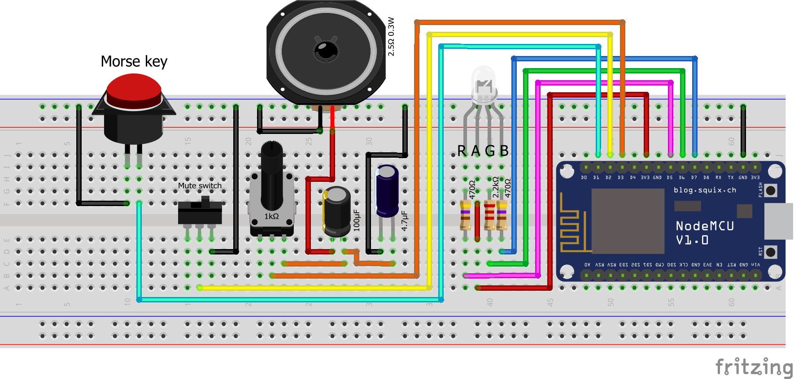

# Telegraph

A wireless [morse] telegraph system for the NodeMCU ESP8266 chip

## General info

Have you ever wanted to be a 1920s radio operator but didn't want to get a wireless telegraphy setup,
a retro morse key and an amateur radio license?

Fear not, Telegraph will replace all three with a NodeMCU and some hardware!

- Uses the NodeMCU v1.0, ESP8266-12E v2 Amica board.
  - There are multiple versions of the NodeMCU with confusing names. This board is the newest official one and has a
standard breadboard size. See [this article](https://frightanic.com/iot/comparison-of-esp8266-nodemcu-development-boards/) for reference.
- Uses the [Thinger.io](https://thinger.io/) service to communicate between devices
- Currently only supports communication between two devices, which is the maximum you can have with a free Thinger.io plan
- The morse key for this project uses [this 3D-printed design](https://www.thingiverse.com/thing:3167343)
- Note: pulses less than 7ms in length will be ignored as debounce noise

## Installation

1. Build the circuit as shown in the diagrams below
1. Install the [Arduino IDE](https://www.arduino.cc/en/main/software)
1. Install the [NodeMCU Add-On](https://randomnerdtutorials.com/how-to-install-esp8266-board-arduino-ide/)
1. Install the [Thinger.io library](https://docs.thinger.io/devices/arduino)
1. Modify the preferences under the `preferences.ino` file to include your WiFi details and Thinger credentials
1. Connect the NodeMCU to your computer via USB and upload the code

## Circuit

The circuit contains a morse key (which can be any button), a speaker, and an RGB LED light.
These are hooked up using resistors and capacitors. A breadboard also helps a lot. The circuit is as follows:

 

## Credits

- Ega on the Thinger.io forum for [this wild goose chase of a conversation](https://community.thinger.io/t/how-to-receive-a-stream-on-a-nodemcu/3113)
- Samuel Morse
- [How to exit vim](https://stackoverflow.com/questions/11828270/how-do-i-exit-the-vim-editor)

